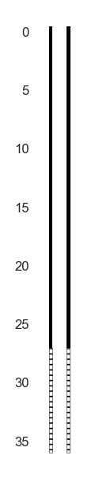

# well-schematics

[](https://github.com/kinverarity1/well-schematics/blob/master/LICENSE)
[](https://pypi.python.org/pypi/well-schematics/)
[](https://pypi.python.org/pypi/well-schematics/)
[](http://well-schematics.readthedocs.io/?badge=latest)

matplotlib code for drawing borehole/well schematic diagrams

## Install

```bash
$ pip install -U well-schematics
```

## Usage

Check out the [documentation](http://well-schematics.readthedocs.io/?badge=latest).

```python
>>> from well_schematics import draw_simple
>>> draw_simple(pzone_top=27, pzone_bottom=36, casing_top=-0.5, pzone_type="S")
```



## Contributing / roadmap

Any contributions at all are welcome! 

Please have a look at the current [list of ideas](https://github.com/kinverarity1/well-schematics/labels/enhancement) or check out the [simple roadmap](https://github.com/kinverarity1/well-schematics/milestone/1) for what I am personally planning to work on first.

## License

Free to modify and re-distribute under the [MIT license](LICENSE).
