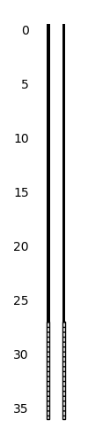

Examples
========

.. code-block:: python

    import well_schematics as ws

    ws.plot_single_diameter_well(
        [
            {"type": "casing", "top": -0.5, "bottom": 27},
            {"type": "screen", "top": 27, "bottom": 36},
        ]
    )

